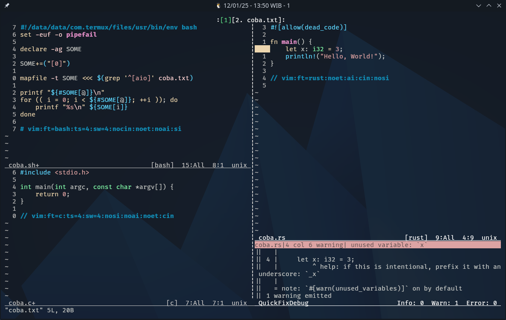

# GlassVim

Personal Vim9 Complete Setup.

Most of the plugin scripts used here are written by me using vim9script.

## Features (plugin)
* [statusline theme](https://github.com/arfanamd/Litebar)
* [tabline theme](https://github.com/arfanamd/sttabline)
* [quickfix theme](https://github.com/arfanamd/qfdebug)
* template/skeleton
* [surround](https://github.com/tpope/vim-surround)
* [diffOrig](https://github.com/lifecrisis/vim-difforig)
